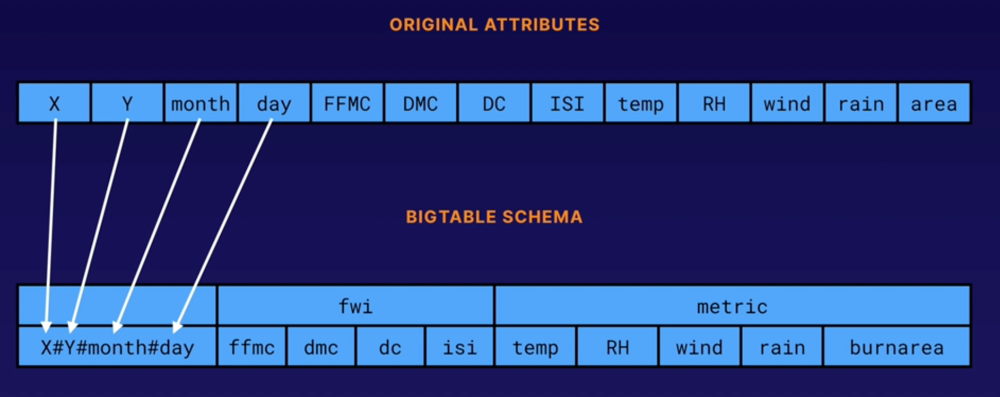

### Demo: Working with Cloud Bigtable
- cbt reference: https://cloud.google.com/bigtable/docs/cbt-reference
- code exampel: git clone https://github.com/ACloudGuru-Resources/Course_Google_Certified_Professional_Data_Engineer.git cloud-bigtable-examples

*** HBase Shell Commands ***
```bigquery
create 'vehicles', 'loc', 'det'
list
describe 'vehicles'
put 'vehicles', 'M117-223', 'loc:lat', '40.781212'
put 'vehicles', 'M117-223', 'loc:long', '-73.961942'
put 'vehicles', 'M117-223', 'det:company', 'NYMT'
put 'vehicles', 'M117-223', 'det:route', '86'
scan 'vehicles'
get 'vehicles', 'M117-223'
put 'vehicles', 'M117-391', 'loc:lat', '40.780664'
put 'vehicles', 'M117-391', 'loc:long', '-73.958357'
put 'vehicles', 'M117-391', 'det:company', 'NYMT'
put 'vehicles', 'M117-391', 'det:route', '88'
scan 'vehicles'
scan 'vehicles', { COLUMNS => 'det:route', FILTER => "ValueFilter( =, 'regexstring:88')" }
scan 'vehicles', {ROWPREFIXFILTER => 'M117-2'}
```


*** Set up CBT ***
```commandline
echo project = YOUR_PROJECT_NAME > ~/.cbtrc
echo instance = lab-instance >> ~/.cbtrc
```

*** CBT Commands ***
```commandline
cbt listinstances
cbt listclusters
cbt ls
cbt ls vehicles
cbt read vehicles
cbt listappprofile labinstance
```

### Bigtable schema design (Rowkey) Avoid Hotspotting
- Field promotion: M117-223 -> WoodMac#86#timestamp#M117-223
- Never put timestamp/sequecial as start of Rowkey
- Salting
- Avoid Hash
- Key Visualizer Tool

### Demo: Loading and Querying Data with Cloud Bigtable
- Example: git clone https://github.com/ACloudGuru-Resources/Course_Google_Certified_Professional_Data_Engineer.git cloud-bigtable-examples
- UCI machine learnign repo: https://archive.ics.uci.edu/ml/about.html
- Apply Field promotion Rowkey desgin:

- Run the program:
```commandline
echo project = playground-s-11-ae11f3f8 >> ~/.cbtrc
echo instance = labinstance >> ~/.cbtrc
cat ~/.cbtrc
cbt listinstances
cbt createtable fires
cbt createfamily fires fwi
cbt createfamily fires metrics
cbt ls fires
echo $DEVSHELL_PROJECT_ID
sudo pip3 install google-cloud-bigtable
python3 dataloader.py
cd cloud-bigtable-examples/quickstart/
./quickstart.sh
scan 'fires'
scan 'fires',  { ROWPREFIXFILTER => '2#2#aug#', COLUMNS => 'metrics:area' }
scan 'fires',  { ROWPREFIXFILTER => '2#2#aug#', COLUMNS => 'metrics }
```
- Good row key design is essential. Cloud Bigtable queries use the row key, a row key prefix, or a row range to retrieve the data. Other types of queries trigger a full table scan, which is much less efficient. Using human-readable values makes it much easier to troubleshoot issues with Cloud Bigtable. See: https://cloud.google.com/bigtable/docs/schema-design
-A reverse domain name would make a good row key, especially if each row's data overlaps with adjacent rows. This allows Cloud Bigtable to compress your data more efficiently.  See: https://cloud.google.com/bigtable/docs/schema-design
- UUIDs are not optimal for scan or sequential read operations.
