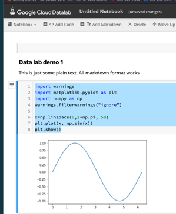

### Demo: Working with Cloud Datalab (Jupiter Notebook)
```commandline
datalab create my-datalab
datalab connect my-datalab
datalab delete my-datalab

### make sure the new instance use the same zone as last time so that it could resue the disk my-datalab-pd
datalab create new-datalab --disk-name my-datalab-pd
```

- Jupyter course for Data Scientist: https://learn.acloud.guru/course/introduction-to-jupyter-notebooks/overview
- Data distribution (know it is enough as a Data Engineer): https://learn.acloud.guru/course/gcp-certified-professional-data-engineer/learn/e4252245-e8d6-25b8-4e84-d68d10286d71/f36ac389-4636-f340-fd7b-eee443cffe9f/watch

