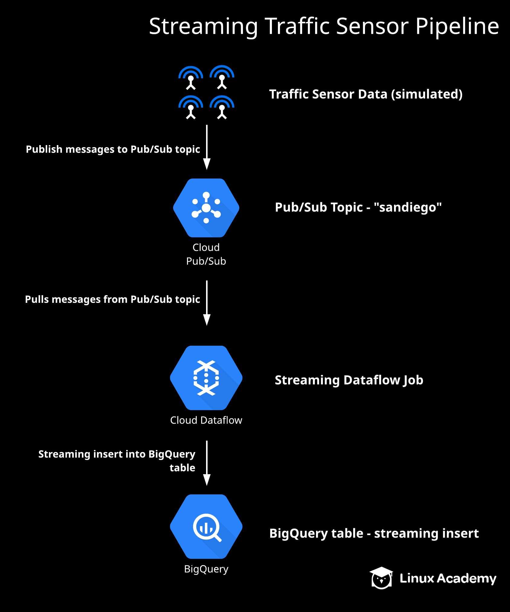

### Additional Resources:
- Using Dataflow(pipeline): https://cloud.google.com/dataflow/docs/guides/deploying-a-pipeline
- Machine learning with Dataflow:
- Flexsible Resource Scheduing(FlexRS): 
  - Advanced scheduling
  - Cloud Dataflow Shuffle Service
  - Preemptble VMs
- Migrating MapReduce jobs to Cloud Dataflow
- Cloud Dataflow with Pub/Sub Seek
#### Cloud Dataflow SQL
- Apache Beam SQL (un)bounded PCollections

### Dataflow vs Cloud Composer

### Demo: Working with Cloud Dataflow
```
mvn archetype:generate \
      -DarchetypeGroupId=org.apache.beam \
      -DarchetypeArtifactId=beam-sdks-java-maven-archetypes-examples \
      -DarchetypeVersion=2.8.0 -DgroupId=org.example \
      -DartifactId=dataflow-lab -Dversion="0.1" \
      -Dpackage=org.apache.beam.examples -DinteractiveMode=false

export PROJECT_ID=playground-s-11-a567ec94
export BUCKET_NAME=playground-s-11-a567ec94-dflow-batch


mvn -Pdataflow-runner compile exec:java \
      -Dexec.mainClass=org.apache.beam.examples.WordCount \
      -Dexec.args="--project=${PROJECT_ID} \
      --stagingLocation=gs://${BUCKET_NAME}/staging/ \
      --output=gs://${BUCKET_NAME}/output \
      --runner=DataflowRunner"

```

### Demo: Streaming Pipelines with Cloud Dataflow
#### Dataflow to BigQuery
- Create a fake social network seed
- Publish message to Pub/Sub
- Create a streaming dataflow pipeline:
  - Transform messages
  - Check the messages that should be flagged
``` 
  Remember to activate the virtual Python environment in any terminal you use:

  cd tweeper
  source bin/activate

Activate the Tweep feed:

  python tweeper.py

Test the pipeline locally:

  python pipeline.py --streaming

Run the pipeline with Cloud Dataflow:

  python pipeline.py --streaming --runner DataflowRunner \
  --project <YOUR_PROJECT_NAME> \
  --temp_location gs://<YOUR_BUCKET_NAME>/temp \
  --staging_location gs://<YOUR_BUCKET_NAME>/staging \
  --region us-central1 \
  --job_name tweeps
```


### Create a Streaming Data Pipeline on GCP with Cloud Pub/Sub, Dataflow, and BigQuery
Introduction
This lab will simulate live highway sensor data which will be published to a Cloud Pub/Sub topic. Then, a Cloud Dataflow streaming pipeline will subscribe to it. The pipeline will take the streaming sensor data, transform it, and insert it into a BigQuery table. We will then view the streaming inserts in BigQuery while they are in progress, and attempt to gain some useful insights from the streaming data.
Prepare Your Environment
Click the Activate Cloud Shell icon along the top of the page, then click Continue to open Cloud Shell.
Enable the pubsub and dataflow APIs:
gcloud services enable dataflow.googleapis.com
gcloud services enable pubsub.googleapis.com
Create a Cloud Storage bucket for Dataflow staging:
gsutil mb gs://$DEVSHELL_PROJECT_ID
Clone the GitHub repository used for lab resources:
cd ~
git clone https://github.com/linuxacademy/googledataengineer
Create a Pub/Sub Topic
Create your topic and name it sandiego:

gcloud pubsub topics create sandiego
Navigate to the GCP web console in a new tab to verify the topic was created.

Click the navigation menu icon in the top left corner, then scroll down to the Big Data section and select Pub/Sub. On the Topics tab, you should see your newly created sandiego topic.
Create a BigQuery Dataset to Stream Data Into
Navigate back to Cloud Shell.
Create a BigQuery dataset to stream data into:

bq mk --dataset $DEVSHELL_PROJECT_ID:demos
Note: The table will be named average_speeds. We do not create the table, but Dataflow will create it within the dataset for us.

Navigate back to the GCP web console to verify the dataset was created.

Click the navigation menu icon, then scroll down to the Big Data section and select BigQuery. You should see your project name and a dataset called demos.
View the Dataflow Template
Navigate back to Cloud Shell.
Review the Apache Beam template Dataflow will use:
vim googledataengineer/courses/streaming/process/sandiego/src/main/java/com/google/cloud/training/dataanalyst/sandiego/AverageSpeeds.java
Press the Esc key, then type :q! to exit out of the file without making any changes.
Create the Dataflow Streaming Job
Open your cloned GitHub directory:
cd ~/googledataengineer/courses/streaming/process/sandiego
List the existing files:
ls
Execute the script that creates the Dataflow streaming job:
./run_oncloud.sh $DEVSHELL_PROJECT_ID $DEVSHELL_PROJECT_ID AverageSpeeds
Navigate back to the GCP web console to verify the streaming job was successful.
Click the navigation menu icon, then scroll down to the Big Data section and select Dataflow. You should see your streaming job is waiting for input.
Use the navigation menu to select Pub/Sub, then select Subscriptions in the sidebar menu. Note that your subscription is now subscribed to your Dataflow topic.
Publish Simulated Traffic Sensor Data to Pub/Sub via a Python Script and Pre-Created Dataset
Navigate back to Cloud Shell.
Install any requirements for the Python script:
sudo pip install -U google-cloud-pubsub
Change directory into the folder that will use the Python script to simulate data:
cd ~/googledataengineer/courses/streaming/publish
View the existing files:
ls
Download the simulated sensor data:
gsutil cp gs://la-gcloud-course-resources/sandiego/sensor_obs2008.csv.gz .
View the files again, and note that sensor_obs2008.csv.gz is now listed.
ls
Execute the Python script to publish simulated streaming data to Pub/Sub:
./send_sensor_data.py --speedFactor=60 --project=$DEVSHELL_PROJECT_ID
View the Streamed Data in BigQuery
Navigate back to the GCP web console and use the navigation menu to select Dataflow.
Select your streaming job. You can see all the transforms your data is going through before it is inserted into the BigQuery dataset and table.
Select the navigation menu icon, then scroll down to Big Data and select BigQuery.
Expand your project ID on the left, then expand the demos dataset.
Select the average_speeds table, then review the Details and Preview data. If no data displays, this indicates the data is sitting in the streaming buffer.
Click Query table and run the following query to view the current streamed data:
SELECT *
FROM `database_name.demos.average_speeds LIMIT 1000`
Remember that the database name in the query will be different.

Notice the total count of records at the bottom. Wait about a minute and run the same query again (be sure to uncheck use cached results in the query options) and notice that the number has increased.

Use Aggregated Queries to Gain Insights
Run the following query to view which highway lanes have the most sensor counts:
SELECT lane, sum(lane) as total
FROM `demos.average_speeds`
GROUP BY lane
ORDER BY total DESC
Run the following query to view which lanes have the highest average speeds:
SELECT lane, avg(speed) as average_speed
FROM `demos.average_speeds`
GROUP BY lane
ORDER BY average_speed DESC